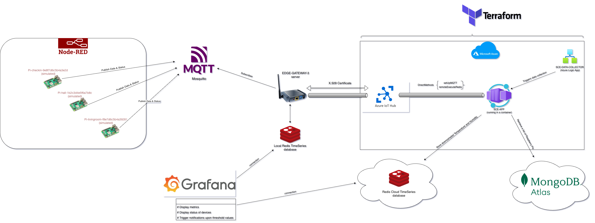

# SCE

## Architecture Overview

---

## Key Features
- Azure IoT Hub used as a cloud gateway
- MongoDB for keeping records of edge gateways and their Raspberry Pis
- Redis TimeSeries - for time-series sensor data

## Project Structure

### Azure/
* Node.js app for cloud control and data processing

### Edge/
* Grafana - to display the incoming sensor data
* Node.js app - for local data processing and aggregation
* Nodered - to simulate payload from Raspberry Pis
* Redis - for storing the payload
* MQTT - to connect Node.js app and simulated Raspberry Pis
* Splunk - for tracking security events
